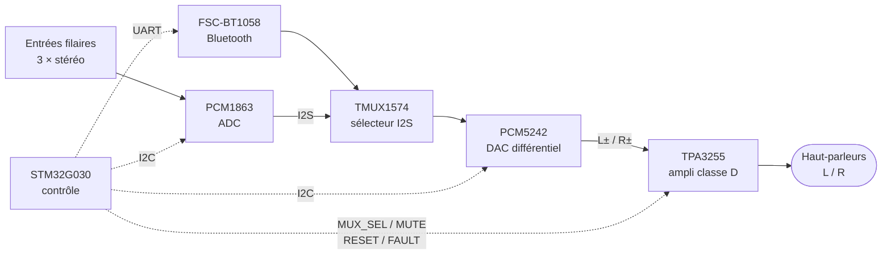

# Ampli-D

Amplificateur audio stéréo **classe D** open hardware : entrées filaires et Bluetooth, DAC audiophile,
pilotage par microcontrôleur STM32. Le dépôt contient l'ensemble de la conception — schémas, PCB et firmware.

> **État du projet :** conception matérielle terminée côté schémas, routage du PCB en cours,
> firmware au stade du squelette généré (STM32CubeMX).

---

## Aperçu




## Caractéristiques

| Bloc | Composant principal | Rôle |
|------|--------------------|------|
| **Amplification** | TI **TPA3255** (DDV) | Étage de puissance classe D stéréo, filtres de sortie 10 µH / 25 A |
| **DAC** | TI **PCM5242** | Conversion I2S → analogique différentiel, sortie directe vers l'ampli |
| **Sélecteur de source** | TI **TMUX1574** | Aiguillage des flux I2S (filaire / Bluetooth) |
| **Entrées filaires** | TI **PCM1863** | 3 entrées stéréo numérisées (jacks Neutrik NMJ4HFD2 + jack 3,5 mm) |
| **Bluetooth** | **FSC-BT1058** | Réception audio sans fil (I2S) + contrôle par UART |
| **Contrôle** | ST **STM32G030C8T6** | Sélection de source, volume/EQ via I2C, appairage BT, gestion des défauts |
| **Alimentation** | LM5017 · TLV76733 · LT3042 | 36–48 V d'entrée → 12 V → 3,3 V numérique + 3,3 V analogique faible bruit |

**Interface utilisateur :** commutateur rotatif 4 positions (source), bouton poussoir (appairage Bluetooth),
4 potentiomètres lus par l'ADC du STM32 (volume et égalisation).

## Structure du dépôt

```
Ampli-D/
├── Kicad Workspace/        # Projet KiCad 10 (schémas hiérarchiques + PCB 2 couches)
│   ├── alimentation.kicad_sch
│   ├── amplification.kicad_sch
│   ├── bluetooth.kicad_sch
│   ├── eq_and_dac.kicad_sch
│   ├── mcu.kicad_sch
│   ├── wired_input.kicad_sch
│   ├── Components Lib.kicad_sym    # Symboles personnalisés
│   ├── FootPrints.pretty/          # Empreintes personnalisées
│   └── Lib Import/                 # Symboles / empreintes / STEP fabricants
├── STM32 Workspace/        # Projet STM32CubeIDE (STM32G030C8T6)
│   ├── MCU.ioc                     # Configuration CubeMX
│   ├── Core/                       # Code applicatif
│   └── Drivers/                    # HAL STM32G0 + CMSIS
└── Ressources/             # Datasheets, modèles 3D, outils de calcul
```

## Alimentation

| Rail | Régulateur | Usage |
|------|-----------|-------|
| 36 V / 48 V | entrée externe | PVDD du TPA3255 |
| 12 V | LM5017 (buck 100 V) | GVDD / pilotage de l'étage de puissance |
| 3,3 V | TLV76733 | Numérique (STM32, Bluetooth) |
| 3,3 V A | LT3042 (LDO ultra faible bruit) | Analogique (DAC, ADC) |

## Démarrage

**Matériel** — ouvrir le projet avec [KiCad](https://www.kicad.org/) **10.0 ou supérieur** :

```bash
kicad "Kicad Workspace/Kicad Workspace.kicad_pro"
```

**Firmware** — ouvrir `STM32 Workspace/` dans [STM32CubeIDE](https://www.st.com/en/development-tools/stm32cubeide.html),
puis compiler et flasher via ST-Link. La configuration des périphériques se modifie depuis `MCU.ioc`
(I2C1, USART1, ADC1 + DMA, TIM1).

## Feuille de route

- [x] Schémas des six blocs fonctionnels
- [x] Symboles et empreintes des composants clés (TPA3255, PCM5242, FSC-BT1058, inductances de sortie)
- [ ] Routage complet du PCB
- [ ] Firmware : sélection de source, contrôle I2C du DAC/ADC, lecture des potentiomètres, gestion des défauts
- [ ] Fabrication et validation du premier prototype

## Ressources

Les datasheets des composants principaux sont regroupées dans [`Ressources/Datasheet/`](Ressources/Datasheet/) :
TPA3255, PCM5242, FSC-BT1026x. Le classeur `LM5017QuickStartCalculator.xls` sert au dimensionnement du convertisseur.
